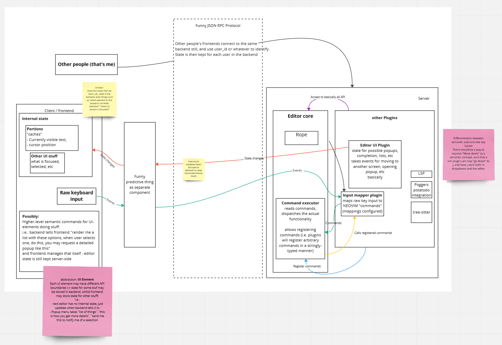

# bazed.

This project follows the foot (-erminal)'s naming scheme. It is in fact the baz
editor.

The editor consists of a backend including the core data structure on which
modifications are made consistent through CRDT and plugin engine (stew).

